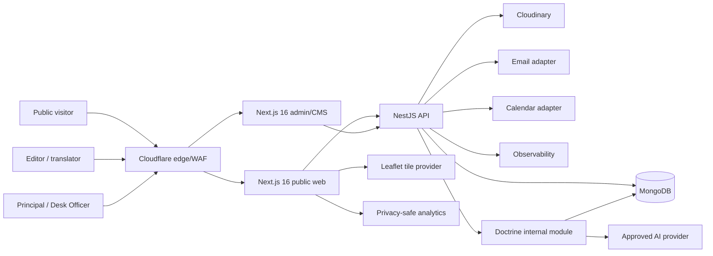
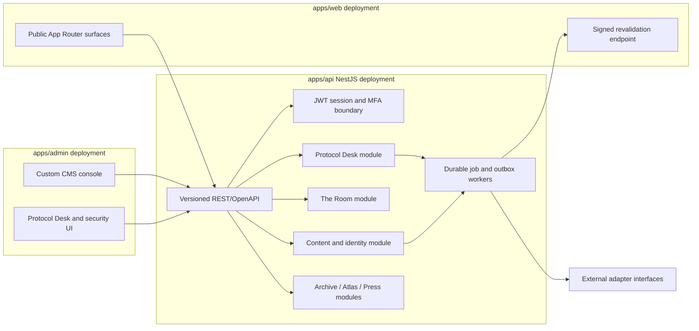

# Project AMANOR architecture

## Status

This package records the confirmed technical baseline and the security-preserving adaptations required by the founding build brief. Decisions with external dependencies remain marked as proposed until stakeholder or security approval.

The current processing map and proposed deletion controls are maintained in the [data inventory and retention schedule](../privacy/data-inventory-retention.md). Its engineering evidence is not a substitute for Legal/Data Protection approval.

The implemented HTTP conventions are catalogued in the [versioned API contract](./api-contracts.md), and the current MongoDB ownership, collections and privacy flows are catalogued in the [schema and data-flow package](./mongodb-schema-and-data-flows.md).

## System context



The platform has three independently deployable applications. `apps/web` is the public frontend, `apps/admin` is the protected CMS/operations frontend, and `apps/api` is the NestJS backend. Only the API owns business logic, persistence, privileged authentication and provider secrets.

## Application containers



## Boundaries

- **Public delivery:** `apps/web` is static/server-rendered by default, with narrow dynamic islands. It reads published projections through the API and has no database credentials.
- **Admin/CMS:** `apps/admin` is a protected, `noindex`, independently deployed API client. It owns no authoritative workflow or persistence logic.
- **NestJS API:** `apps/api` owns all business rules, MongoDB/Mongoose access, JWT/session enforcement, workflows, jobs and provider integrations.
- **Content/CMS domain:** draft, version, translation, approval and publish state live in backend-owned collections. Publishing appends an audit event and triggers a signed web revalidation webhook.
- **Identity:** the canonical identity singleton is the only source for names, titles, biographies, pronunciation and press outputs.
- **Authentication:** privileged access uses short-lived JWT access tokens and rotating opaque refresh secrets represented by server-side session records. JWTs do not replace revocation state.
- **Protocol Desk:** owns booking data, state transitions, policy rules and immutable decision events. It may read the published identity projection but cannot mutate CMS content.
- **The Room:** owns ciphertext and minimal routing metadata under separate database credentials. Plaintext must not enter logs, analytics, search indexes or general-purpose audit payloads. Its implementation is gated by the [Room threat model](../security/the-room-threat-model.md).
- **Doctrine:** post-launch and disabled by default. Retrieval and model calls stay behind an internal interface; failure returns the curated Positions experience.
- **Integrations:** email, calendar, Cloudinary, tile, AI and analytics providers sit behind typed adapters with explicit timeout, retry, idempotency and degradation behaviour.

## Repository shape

```text
apps/
  web/                    Next.js 16 public frontend
  admin/                  Next.js 16 protected CMS/admin frontend
  api/                    NestJS backend
    src/modules/          auth, content, identity, atlas, archive, desk, room, doctrine
    src/platform/         MongoDB, Cloudinary, email, calendar, observability
packages/
  contracts/              safe API schemas and generated client contracts
```

Frontend applications cannot import API source, Mongoose, NestJS packages or backend secret names; `scripts/check-boundaries.mjs` enforces this. API domain modules do not import controllers or provider SDKs. Provider adapters implement module-owned interfaces. MongoDB sessions cover transitions spanning authoritative state and outbox/audit writes.

## Data ownership

| Module        | Collections                                                                                                                                                                  | Notes                                                                                                                                                                     |
| ------------- | ---------------------------------------------------------------------------------------------------------------------------------------------------------------------------- | ------------------------------------------------------------------------------------------------------------------------------------------------------------------------- |
| Auth          | `users`, `sessions`, `refresh_token_consumptions`, `auth_events`, `auth_notification_jobs`                                                                                   | MFA ciphertext/recovery hashes live on users; refresh families and complete replay evidence are separate; recovery revocation and notification enqueue are transactional. |
| Content       | `content_documents`, `content_versions`, `publication_events`, `editorial_audit`                                                                                             | Locale state is field-level; publish points to an immutable version.                                                                                                      |
| Identity      | `identities`                                                                                                                                                                 | Singleton enforced by a unique key; versioned title ranges and sources.                                                                                                   |
| Atlas/archive | Authoritative `content_versions` plus `publications`; materialised projections: `atlas_nodes`, `archive_items`, `sources`, `speaking_themes`                                 | Publish, rollback and unpublish synchronise exact bilingual version slots transactionally; public delivery still resolves the authoritative publication pointer.          |
| Desk          | `engagement_requests`, `engagement_events`, `blackouts`, `counterparties`, `desk_outbox`                                                                                     | State transitions and audit event append occur transactionally.                                                                                                           |
| Room          | `room_enquiries`, `room_access_events`                                                                                                                                       | Separate database user; encrypted payload; aggressively minimised metadata.                                                                                               |
| Programme     | Authoritative `content_versions` plus `publications`; materialised projections include `signals`, `scholars`, `office_hours_cycles`, `office_hours_answers`, `selah_entries` | Consent and two-person rules are schema/application invariants; exact locale/version slots and deterministic index data are transactionally maintained.                   |
| Operations    | `migrations`, `outbox_jobs`, `idempotency_keys`                                                                                                                              | Forward-only migrations and retryable provider work.                                                                                                                      |

## Data flow: CMS publish

```mermaid
sequenceDiagram
  participant E as Editor
  participant C as Admin CMS
  participant A as NestJS API
  participant M as MongoDB
  participant R as Reviewer
  participant N as Next cache
  E->>C: Save bilingual draft
  C->>A: Save bilingual draft
  A->>M: Append immutable version
  E->>C: Submit for review
  R->>A: Approve (must differ where policy-sensitive)
  A->>M: Transaction: publish pointer + audit + outbox
  A-->>N: Signed revalidation webhook
  N-->>A: Result recorded; retry on failure
```

## Data flow: JWT refresh

```mermaid
sequenceDiagram
  participant B as Browser
  participant A as Auth boundary
  participant M as MongoDB
  B->>A: Refresh cookie + CSRF proof
  A->>M: Find active session by family/id
  M-->>A: Hashed current token, expiry, role/version
  A->>A: Constant-time verify; require MFA/step-up if needed
  A->>M: Transactionally revoke old + store rotated hash
  A-->>B: New short access JWT + rotated secure cookie
```

Replay of an already-rotated refresh token revokes its entire token family and emits a high-severity authentication event.

## Availability and degradation

| Dependency              | Required behaviour on outage                                                                  |
| ----------------------- | --------------------------------------------------------------------------------------------- |
| MongoDB                 | Static cached public content remains available; writes fail closed with a traceable response. |
| Cloudinary              | Existing transformed assets remain edge-cached; CMS upload reports a recoverable failure.     |
| Email                   | Transactional outbox retries with exponential backoff; no request decision is silently lost.  |
| Calendar                | Local holds remain authoritative; adapter reconciles later and displays an operator warning.  |
| Leaflet tiles           | Atlas table twin remains fully functional and becomes default in Sahel Mode.                  |
| Doctrine provider       | Serve curated Positions content without a user-visible provider error.                        |
| Analytics/observability | Product actions continue; telemetry is bounded and never blocks the user path.                |

HTTP calls cross deployment boundaries with a bounded `X-Request-ID` and W3C
`traceparent`. The API creates a server span, returns both identifiers and emits
a privacy-minimised structured completion event. The operational contract and
provider-independent staging gates are documented in
[the observability runbook](../operations/observability.md).

## Environment and release model

- Web, admin and API each have local, protected preview/staging, and production environments as separate trust zones.
- Production and previews use separate database users, Cloudinary upload presets, secrets and sender identities.
- Previews are authenticated, `noindex`, excluded from sitemaps and validated against accidental indexing.
- Web, admin, API and content publish independently. MongoDB shape changes use reviewed, idempotent, forward-only API migrations.
- A durable outbox prevents provider outages from losing accepted state changes.
- Rollback restores an application release or prior published content pointer; migrations are superseded forward rather than destructively reversed.

## Architecture acceptance gaps

The baseline is implementable, but these require named stakeholder approval before their dependent release gates can close:

1. MFA credential policy (WebAuthn/passkeys recommended; TOTP fallback and single-use recovery codes).
2. MongoDB hosting/region, backup, key management and vector-search availability.
3. Leaflet tile provider, attribution and permitted caching policy.
4. Email, calendar, hosting, analytics and observability provider accounts.
5. Doctrine feature/product approval and AI provider.
6. The Room encryption/key-custody model and legal retention schedule.

## ADR index

- [ADR-001 - Next.js application shape](./adr/001-nextjs-application.md)
- [ADR-002 - MongoDB and Mongoose](./adr/002-mongodb-mongoose.md)
- [ADR-003 - Custom JWT authentication](./adr/003-custom-jwt-auth.md)
- [ADR-004 - First-party CMS](./adr/004-custom-cms.md)
- [ADR-005 - Cloudinary media](./adr/005-cloudinary-media.md)
- [ADR-006 - Leaflet Atlas](./adr/006-leaflet-atlas.md)
