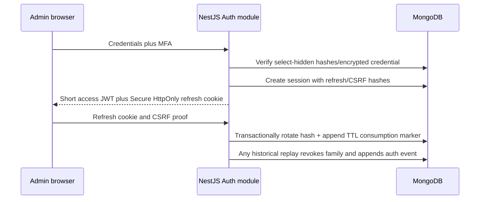
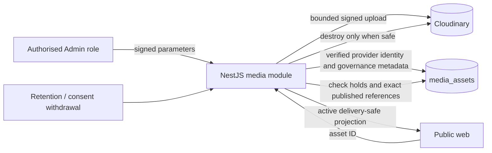

# MongoDB collection model and privacy flows

- Status: Implemented collection inventory; Architecture/Privacy review required
- Scope: AMANOR-010
- Runtime authority: Mongoose schemas, bounded repositories and forward-only migrations in `apps/api`
- Policy companion: [data inventory and retention schedule](../privacy/data-inventory-retention.md)

## Storage rules

Only the independently deployed NestJS API holds MongoDB credentials. Public web and Admin/CMS receive explicit projections over `/v1`. Repositories bound queries and projections; persisted-shape changes use idempotent forward-only migrations. Application transactions bind authoritative state changes to immutable events and durable outbox work where a workflow crosses collections or providers.

The first-party CMS uses immutable `content_versions` plus locale-specific `publications` pointers as runtime authority. Publish, rollback and unpublish transactionally materialise each document into its named structured collection. Every projection carries exact `en-GB` and `fr-FR` version/payload slots and deterministic index data selected from English, falling back to French. Public delivery continues to resolve the authoritative pointer; the projection integrity verifier detects missing, mismatched and orphan slots.

## Implemented collection catalogue

| Domain                  | Collections                                                                                                                                                                                                                                                                                                                                                                                               | Key invariant / sensitive state                                                                                                                                                                                                                                       |
| ----------------------- | --------------------------------------------------------------------------------------------------------------------------------------------------------------------------------------------------------------------------------------------------------------------------------------------------------------------------------------------------------------------------------------------------------- | --------------------------------------------------------------------------------------------------------------------------------------------------------------------------------------------------------------------------------------------------------------------- |
| Authentication/security | `users`, `sessions`, `refresh_token_consumptions`, `auth_events`, `auth_event_chain`                                                                                                                                                                                                                                                                                                                      | Current refresh and CSRF values remain select-hidden hashes; every consumed refresh hash is transactionally retained until session expiry; sessions/consumptions expire; authentication and parameter-free privileged-read evidence is sequence/hash-linked           |
| CMS and public record   | Runtime authority: `content_versions`, `publications`, `editorial_audit`, `editorial_audit_heads`. Materialised named projections: `identities`, `sources`, `atlas_nodes`, `archive_items`, `speaking_themes`, `signals`, `scholars`, `office_hours_cycles`, `office_hours_answers`, `selah_entries`, `rider_templates`, `email_templates`, `pages`, `blackouts`, `counterparties`, `desk_configurations` | Exact version/locale publication pointers and source-linked validation remain authoritative. Schema-version-2 projections are transactionally synchronised, bilingual and integrity-checkable; pre-projection records are retained in `structured_projection_legacy`. |
| Media                   | `media_assets`                                                                                                                                                                                                                                                                                                                                                                                            | Provider identity plus rights, consent, alt/focal and retention metadata; retirement fails closed on holds/public references                                                                                                                                          |
| Protocol Desk           | `protocol_requests`, `protocol_request_events`, `protocol_request_notes`, `protocol_sequences`, `correspondence`, `protocol_sla_escalations`                                                                                                                                                                                                                                                              | State/event/outbox writes are transactional; official-capacity honorarium is impossible; notes/requester data never enter public projections                                                                                                                          |
| Public request delivery | `contact_enquiries`, `media_enquiries`, `press_kit_requests`, `living_dossier_requests`                                                                                                                                                                                                                                                                                                                   | Minimal receipt/delivery state; current engineering TTL is 180 days pending policy approval                                                                                                                                                                           |
| Reliability and abuse   | `outbox_jobs`, `auth_notification_jobs`, `revalidation_claims`, `rate_limits`, `migrations`                                                                                                                                                                                                                                                                                                               | Unique idempotency keys, bounded retry/locks, transactional recovery notification, TTL replay/rate state and append-only migration identity                                                                                                                           |

The planned `room_enquiries` and `room_access_events` collections do not exist. They require separate credentials and a ciphertext-only envelope after independent cryptographic approval. Office Hours schemas exist as CMS document types, but public ballot/draw persistence and APIs are not delivered.

## Data classification and projections

| Class                  | Examples                                                                | Permitted projection                                                    |
| ---------------------- | ----------------------------------------------------------------------- | ----------------------------------------------------------------------- |
| Public approved        | Exact published content version, approved media delivery metadata       | Explicit public DTO only                                                |
| Privileged operational | Desk state, assignment, availability, account/session state             | Role-protected bounded DTO; no raw database document                    |
| Personal               | Requester contact, scholar consent record, press/contact receipt        | Minimum workflow fields to named role/provider; never logs or analytics |
| Secret/authenticator   | Password/refresh hashes, encrypted MFA secret, CSRF hash, provider keys | Never selected by ordinary repositories or returned over HTTP           |
| Confidential planned   | Room ciphertext and minimal encrypted routing metadata                  | Principal plus one designate only; no generic Admin/Desk access         |
| Integrity evidence     | Auth/editorial/Desk event hashes and sequences                          | Redacted protected reports; mutation prohibited by application policy   |

## CMS publication flow

```mermaid
sequenceDiagram
  participant U as Admin editor/reviewer
  participant A as NestJS CMS module
  participant M as MongoDB transaction
  participant W as Revalidation worker
  participant P as Public Next.js
  U->>A: Validated draft/review/publish command
  A->>M: Append content_versions and editorial_audit
  A->>M: Move locale publications pointer and enqueue outbox_jobs
  W->>P: Signed idempotent revalidation
  P->>A: Read exact published projection
  A-->>P: Allowlised fields; no draft/notes/consent evidence
```

## Protocol Desk and provider flow

```mermaid
sequenceDiagram
  participant R as Requester
  participant A as NestJS Desk module
  participant M as MongoDB transaction
  participant W as Correspondence worker
  participant E as Email provider
  R->>A: Validated minimal request and consent
  A->>M: Request + immutable event + correspondence job
  A-->>R: Opaque reference only
  W->>M: Atomic claim with bounded retry
  W->>E: Approved locale template and required recipient fields
  E-->>W: Provider status only
  W->>M: Delivery state; bounded error category, no provider body
```

## Authentication flow



## Media and deletion flow



TTL expiry is asynchronous and is not proof of timely deletion. Subject erasure and retention operations must also reconcile queues, Cloudinary objects and restored backups while pseudonymising rather than corrupting immutable audit/state evidence.

## Isolation and unresolved production controls

- The Room has a named Mongoose connection, a separate database and a separate explicit database user. Enabling it fails configuration unless `ROOM_MONGODB_URI` identifies both a different username and database from `MONGODB_URI`. Its repository accepts only `room_enquiries`, append-only `room_events` and read-only `room_key_manifests`; the general API identity receives no privileges on the Room database, and the Room identity receives no privileges on the application database. The authenticated replica test proves denial in both directions. Provider provisioning and review follow the [Room database boundary runbook](../security/room-database-boundary.md).
- Managed encryption at rest, region, backup retention, point-in-time recovery and key custody remain provider decisions.
- Protocol Desk 36-month pseudonymisation is implemented as a separately privileged idempotent job that preserves immutable events and reconciles restored expired records. Production scheduling and Legal approval remain; ballot 12-month deletion and approved provider/object deletion workers remain open engineering/policy gates.
- Production provider grants and denial evidence remain required; an inventory or URI naming convention alone is not evidence.
- Architecture, Security and Privacy owners must review this model against the signed retention/DPIA package before production.
